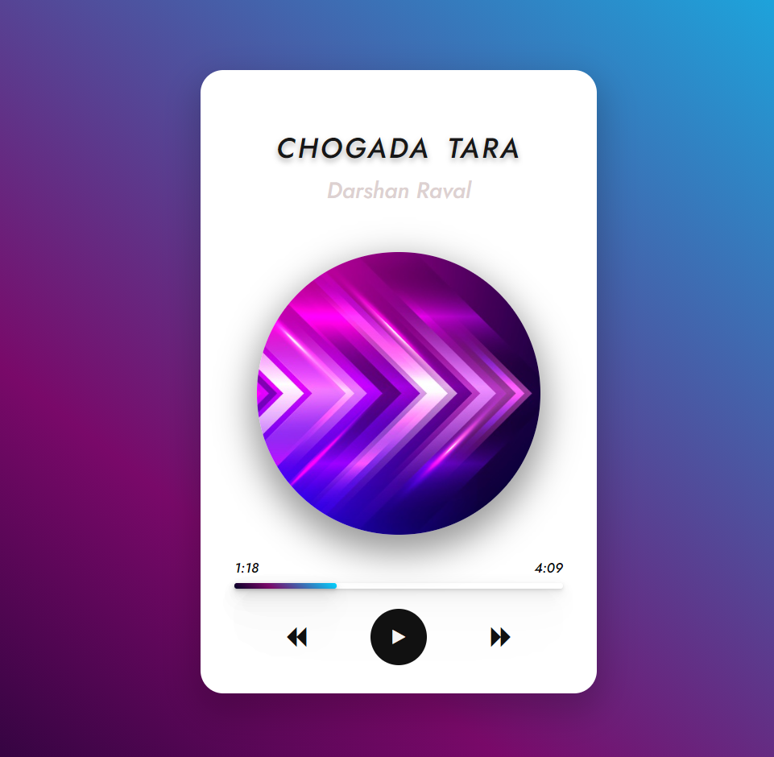

# 🎶 Music Player Using JavaScript

## Images:


## 🔗 Try now:
Click the provided link 👉 [Music Player](https://varshil-shah.github.io/music-player.github.io/)

## 💁🏻‍♂️ Use Case:
You can use this music player to add your favourite music and play it without any kind of subscribtion and ads.

## 💡 Features:
1. Add play/pause button
2. Add next/previous button
3. Continue looping
4. Progress bar
5. Current time and music duration

## 📝 Usage note:
If you want to add new music, follow the below provided steps:
1. Add music,image in the following folders respectively.
2. In script.js file, in songs section, create their objects will the given properties name(song name),title,artist,img(image name).
3. You shouldn't add song and image extension in array of object variable, and the image must be of type jpg.
```javascript
const songs = [
    {
        name: 'song name',
        title: 'song title',
        artist: 'song artist name',
        img: 'img name'
    }
]
```

## About the creator:
### 👨‍💻 [Varshil Shah](https://www.linkedin.com/in/varshil-shah-706028203/ "LinkedIn")
Feel free to contact me on my mail address [Varshil Shah](mailto:varshilshah1004+github@gmail.com) for any queries.

> Stay active,Stay tuned